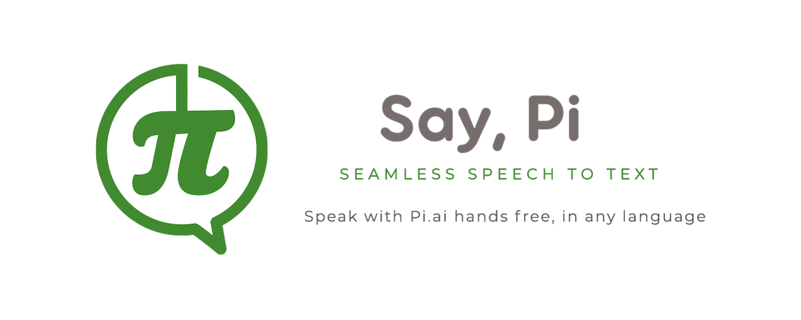

# Say, Pi Browser Extension



**Transform your AI conversations with natural, hands-free voice interaction.**

Say, Pi is a browser extension that brings multilingual voice capabilities to AI chatbots. Built with enterprise-grade architecture and modern web standards, it delivers accurate speech recognition and natural text-to-speech across Pi.ai, Claude.ai, and ChatGPT.

[](https://chromewebstore.google.com/detail/say-pi/glhhgglpalmjjkoiigojligncepccdei)
[](https://addons.mozilla.org/firefox/addon/say-pi/)
[](LICENSE)

[Watch Demo](https://youtu.be/siJAj879ii4) • [Install for Chrome](https://chromewebstore.google.com/detail/say-pi/glhhgglpalmjjkoiigojligncepccdei) • [Install for Firefox](https://addons.mozilla.org/firefox/addon/say-pi/) • [Documentation](https://www.saypi.ai)

---

## What is Say, Pi?

Say, Pi is a three-tier system that enhances AI chat experiences with sophisticated voice interaction:

```
┌─────────────────────────────────────────────────────────────┐
│                                                             │
│  Browser Extension (saypi-userscript)                       │
│  ├─ Content Script: Voice UI, chatbot integration           │
│  ├─ Service Worker: Auth, messaging, lifecycle management   │
│  ├─ Offscreen Documents: Audio processing under strict CSP  │
│  └─ Modern Stack: TypeScript, XState, Webpack, WXT          │
│                                                             │
└─────────────────────────────────────────────────────────────┘
                            ↕
┌─────────────────────────────────────────────────────────────┐
│                                                             │
│  API Server (saypi-api)                                     │
│  ├─ FastAPI/Python: Speech-to-text, text-to-speech          │
│  ├─ OpenAI Whisper: Accurate transcription                  │
│  ├─ Multi-voice TTS: Natural speech synthesis               │
│  └─ Redis: Caching and quota management                     │
│                                                             │
└─────────────────────────────────────────────────────────────┘
                            ↕
┌─────────────────────────────────────────────────────────────┐
│                                                             │
│  Web Application (saypi-saas)                               │
│  ├─ Nuxt.js/Vue.js: Subscription management, user dashboard │
│  ├─ Multi-provider billing: Stripe, LemonSqueezy, Chargebee │
│  ├─ PostgreSQL/Prisma: User accounts, entitlements          │
│  └─ i18n: Multi-language support                            │
│                                                             │
└─────────────────────────────────────────────────────────────┘
```

**This repository** (`saypi-userscript`) contains the browser extension—the client-side component that users install to enable voice chat with AI assistants.

---

## Key Features

### 🎙️ Voice Activity Detection (VAD)
- **Real-time speech detection** using Silero VAD (ONNX models)
- **Intelligent segmentation** for natural conversation flow
- **Dual-mode operation**: Offscreen for Chrome/Edge, onscreen fallback for Firefox/Safari
- Works across all supported browsers and chatbot platforms

### 🗣️ Text-to-Speech (TTS)
- **Natural voice synthesis** with multiple voice options
- **CSP-compliant audio playback** via Chrome Offscreen Documents API
- **Chatbot-specific integration**: Native support for Pi.ai, Claude.ai (desktop Chrome/Edge), ChatGPT (all browsers)
- See [Browser Compatibility Matrix](doc/BROWSER_COMPATIBILITY.md) for platform-specific details

### 🎯 Accurate Speech Recognition
- **OpenAI Whisper integration** for high-quality transcription
- **Multi-language support** with automatic language detection
- **Real-time feedback** during voice input

### 🔌 Seamless Chatbot Integration
- **Chatbot abstraction layer** with pluggable implementations
- **Progressive DOM observation** with backoff for SPA compatibility
- **Event-driven architecture** for loose coupling between components

---

## Architecture & Engineering

### Design Principles

This extension embodies enterprise development standards applied to browser extensions:

- **Separation of Concerns**: Modular architecture with clear boundaries (audio, VAD, TTS, DOM, auth)
- **Progressive Enhancement**: Graceful degradation across browsers and CSP environments
- **Type Safety**: Full TypeScript coverage with strict compilation
- **State Management**: XState finite state machines for predictable audio/UI flows
- **Event-Driven Design**: EventBus for decoupled module communication
- **Testability**: Dual test framework (Jest for JavaScript, Vitest for TypeScript) with 80%+ coverage

### Technology Stack

| Layer | Technologies |
|-------|-------------|
| **Build System** | WXT (Web Extension Tooling; Vite/Rollup under the hood), TypeScript 5.2+ |
| **State Management** | XState v5 (state machines; see `src/state-machines/README.md`), RxJS (reactive streams) |
| **Audio Processing** | Web Audio API, AudioWorklet, ONNX Runtime Web |
| **Machine Learning** | Silero VAD models (ONNX), WASM acceleration |
| **Browser APIs** | Offscreen Documents (MV3), Service Workers, chrome.* APIs |
| **Testing** | Jest (JavaScript), Vitest (TypeScript/ESM), JSDOM |
| **Code Quality** | ESLint, Prettier, TypeScript strict mode |

### Module Architecture

```
src/
├── chatbots/               # Chatbot-specific implementations
│   ├── ChatbotService.ts   # Factory for chatbot detection
│   ├── Chatbot.ts          # Abstract base class
│   ├── Claude.ts           # Claude.ai DOM integration
│   ├── Pi.ts               # Pi.ai DOM integration
│   └── bootstrap.ts        # DOMObserver with progressive search
│
├── audio/                  # Audio pipeline
│   ├── AudioModule.js      # Main coordinator
│   ├── OffscreenAudioBridge.js  # Content ↔ offscreen bridge
│   ├── AudioInputMachine.ts     # XState: mic → VAD → STT
│   └── AudioOutputMachine.ts    # XState: TTS → playback
│
├── vad/                    # Voice Activity Detection
│   ├── OffscreenVADClient.ts    # Chrome/Edge (offscreen)
│   ├── OnscreenVADClient.ts     # Firefox/Safari fallback
│   └── custom-model-fetcher.js  # Firefox ArrayBuffer realm fix
│
├── tts/                    # Text-to-Speech
│   ├── TextToSpeechService.ts   # Core TTS management
│   ├── ChatHistoryManager.ts    # TTS queue for chat messages
│   └── VoiceMenuUIManager.ts    # Voice selection UI
│
├── dom/                    # DOM Management
│   ├── Observation.ts      # Found/decorated element tracking
│   └── bootstrap.ts        # Progressive search with backoff
│
├── offscreen/              # Offscreen documents (CSP bypass)
│   ├── audio_handler.ts    # Audio playback under CSP
│   ├── vad_handler.ts      # VAD processing
│   └── media_coordinator.ts     # Message routing
│
├── compat/                 # Browser compatibility
│   ├── BrowserCompatibilityModule.ts  # Detection logic
│   └── CompatibilityNotificationUI.ts # User-facing notices
│
└── svc/                    # Background services
    ├── background.ts       # Service worker (auth, lifecycle)
    └── JwtManager.ts       # Token management with refresh
```

### Build Output & Performance

The build system produces an optimized bundle under 2MB (excluding binary assets):

- **Core bundles**: 8 files, ~1.2MB total (main: 450KB, vendors: 700KB)
- **Dynamic chunks**: Lazy-loaded for chatbot-specific features
- **Binary assets**: 4 WASM files (37MB), 3 ONNX models (5MB)—excluded from Firefox AMO size limits
- **Code splitting**: Vendor libraries separated for optimal caching

See [CLAUDE.md](CLAUDE.md#build-output) for detailed bundle analysis.

### Cross-Browser Compatibility

The extension implements platform-specific adaptations for Chrome, Edge, Firefox, and Safari:

- **Chrome/Edge (Desktop)**: Full feature support via Offscreen Documents API
- **Firefox (Desktop/Mobile)**: VAD + STT on all sites; TTS on Pi.ai and ChatGPT
- **Safari/Mobile Chromium**: Partial support with graceful degradation

See [Browser Compatibility Matrix](doc/BROWSER_COMPATIBILITY.md) for complete platform/feature grid.

### Testing Strategy

Multi-layer testing ensures reliability across browsers and chatbot platforms:

```bash
npm test              # Run all tests (Jest + Vitest)
npm run test:jest     # JavaScript integration tests
npm run test:vitest   # TypeScript unit tests
```

- **Unit tests**: Individual module behavior (Vitest for TS, Jest for JS)
- **Integration tests**: Audio pipeline, VAD/STT flows, DOM observation
- **Mock implementations**: Chrome extension APIs, chatbot DOM structures
- **JSDOM environment**: DOM manipulation testing without browser

---

## Installation

### For Users

Install from your browser's extension store:

- **Chrome/Edge**: [Chrome Web Store](https://chromewebstore.google.com/detail/say-pi/glhhgglpalmjjkoiigojligncepccdei)
- **Firefox**: [Firefox Add-ons](https://addons.mozilla.org/firefox/addon/say-pi/)

### For Developers

**Prerequisites:**
- Node.js ≥22.0.0, npm ≥10.0.0
- Python 3.11.12 (for ONNX pruning during builds)
- `jq` for Firefox builds (`brew install jq` / `apt install jq`)

**Quick Start:**

```bash
# Clone and install dependencies
git clone <repository>
cd saypi-userscript
npm install

# Set up environment (copy and edit)
cp .env.example .env
cp .env.production.example .env.production

# Start development server with hot reload
npm run dev                # Chrome (default)
npm run dev:firefox        # Firefox MV2

# Build for production
npm run build              # Chrome/Edge
npm run build:firefox      # Firefox (with packaging)
```

**Environment Management:**

```bash
# Quick switch between local and remote API servers
npm run switch             # Toggle between local/remote
npm run switch local       # localhost:3000, 127.0.0.1:5001
npm run switch remote      # saypi.ai, api.saypi.ai
npm run switch status      # Check current config
```

**Python Tooling (for ONNX model pruning):**

```bash
# One-time setup per machine (creates .venv/)
npm run setup:python

# Runs automatically during builds, or manually:
npm run copy-onnx          # Copy + prune ONNX models
```

See [CLAUDE.md](CLAUDE.md) for complete development workflow and build commands.

---

## Project Documentation

### For Contributors & Developers

- **[CLAUDE.md](CLAUDE.md)** - Architecture overview, build commands, testing, module organization
- **[CONTRIBUTING.md](CONTRIBUTING.md)** - Project status, contribution policy, feedback channels
- **[Browser Compatibility Matrix](doc/BROWSER_COMPATIBILITY.md)** - Platform/feature support grid with technical explanations

### For Mozilla Reviewers

**Build Verification:**

This extension uses Webpack for bundling. To verify the build matches the submitted code:

```bash
# Install dependencies
npm install

# Configure environment (copy templates, edit as needed)
cp .env.example .env
cp .env.production.example .env.production

# Build extension
npm run build

# Package for Firefox
./package-extension.sh firefox
```

**Build Environment:**
- Node.js v22 LTS (compatible with Mozilla review environment)
- npm v10
- See [README:94-136](README.md#L94-L136) for detailed instructions

The `dist/` output matches the submitted XPI exactly. All bundling is deterministic.

---

## Browser Compatibility Summary

| Browser | Pi.ai | Claude.ai | ChatGPT | Notes |
|---------|-------|-----------|---------|-------|
| **Chrome/Edge Desktop** | ✅ Full | ✅ Full | ✅ Full | All features via Offscreen API |
| **Firefox Desktop** | ✅ Full | ⚠️ Voice input only | ✅ Full | No TTS on Claude (CSP + no offscreen) |
| **Firefox Mobile** | ✅ Full | ⚠️ Voice input only | ✅ Full | Same as desktop |
| **Safari/Kiwi** | ⚠️ Partial | ❌ Limited | ⚠️ Partial | Platform-specific limitations |

**Legend:** ✅ Full support • ⚠️ Partial (voice input works, TTS may be limited) • ❌ Not supported

See [Browser Compatibility Matrix](doc/BROWSER_COMPATIBILITY.md) for technical details and workarounds.

---

## Development & Testing

### Common Commands

```bash
# Development
npm run dev               # Chrome dev server with hot reload
npm run dev:firefox       # Firefox dev (opens temp profile)

# Building
npm run build             # Production build (validates + copies ONNX)
npm run build:firefox     # Firefox build + packaging

# Testing
npm test                  # All tests (Jest + Vitest)
npm run test:vitest:watch # Watch mode for rapid iteration

# Environment
npm run validate:env      # Check .env files (auto-runs before dev/build)
npm run switch            # Toggle local/remote API servers
```

### Debug Features (Development Only)

**Save VAD segments to disk** (for debugging voice detection):

```bash
# In .env (not .env.production):
KEEP_SEGMENTS=true

# Start dev server
npm run dev

# Segments saved to: ~/Downloads/SayPiSegments/
# Format: saypi-segment_<start>_to_<end>_<duration>ms.wav
```

**Note:** `downloads` permission added only in dev builds; production ignores this setting.

---

## Internationalization (i18n)

The extension supports 30+ languages with a flexible translation workflow:

### Quick Translation

```bash
# Translate all content (UI strings + store descriptions)
npm run translate

# Verify setup without running translations
npm run translate:check

# Skip confirmation prompts
npm run translate -- --yes
```

### Targeted Translation (for rapid iteration)

When you only need to translate specific keys (e.g., after updating marketing copy):

```bash
# Translate specific keys from messages.json
python3 tools/i18n/i18n-translate-keys.py appName appDescription

# Translate multiple keys at once
python3 tools/i18n/i18n-translate-keys.py -y callInProgress callNotStarted voiceSettings

# Translate only description.txt (store listings)
python3 tools/i18n/i18n-translate-release-text.py -y
```

**When to use which tool:**
- **`npm run translate`** - Full translation before major releases (slow but comprehensive)
- **`i18n-translate-keys.py`** - Update specific UI strings (fast, targeted)
- **`i18n-translate-release-text.py`** - Update store descriptions only

### Translation Files

**What gets translated:**
- `_locales/{locale}/messages.json` - UI strings (via `translate-cli` for full sync, OpenAI for targeted)
- `_locales/{locale}/description.txt` - Browser store listings (via OpenAI API)

**Requirements:**
- `translate-cli` (Go): `go install github.com/quailyquaily/translate-cli@latest`
- OpenAI API key: `export OPENAI_API_KEY="..."`
- Python 3.6+ with `requests` library: `pip install requests`

---

## License & Contributions

**This is proprietary software.** The source code is publicly visible for transparency and security review, but is **not licensed for modification, distribution, or use** beyond the terms in [LICENSE](LICENSE).

**We are not accepting external code contributions.** However, we value feedback:

- **Bug reports**: Open a GitHub issue with reproduction steps
- **Feature suggestions**: Discuss via issues or contact channels
- **Security concerns**: Email info@saypi.ai

See [CONTRIBUTING.md](CONTRIBUTING.md) for details.

---

## Contact & Support

Questions? Feedback? We'd love to hear from you:

- **Email**: info@saypi.ai
- **Twitter/X**: [@saypi_ai](https://twitter.com/saypi_ai)
- **Facebook**: [Say, Pi](https://www.facebook.com/profile.php?id=61554182755176)
- **Discord**: Find us on the [Pi Party](https://pi.ai/discord) server 🥧

---

## Disclaimer

Say, Pi is an **unofficial enhancement** for Pi.ai, Claude.ai, and ChatGPT. It is not affiliated with Inflection AI, Anthropic, or OpenAI. Use responsibly and respect each platform's terms of service. Compatibility with future platform updates is not guaranteed.

---

**Built with ❤️ by the Say, Pi team** • [www.saypi.ai](https://www.saypi.ai)
