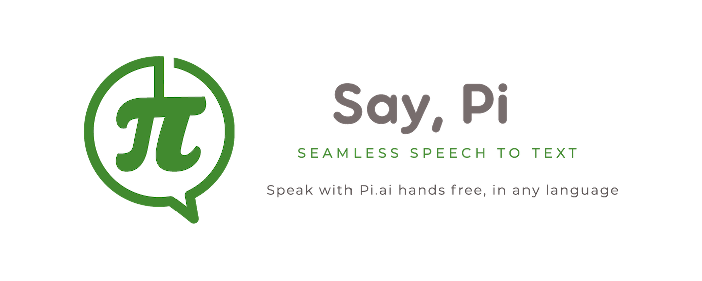

# Say, Pi Browser Extension

Enhance your voice interactions with Inflection AI's Pi chatbot with the _Say, Pi_ extension for accurate voice dictation and immersive spoken dialogues.

## Description

`saypi-userscript` is a powerful content script that enhances the voice dictation capabilities of Inflection AI's conversational AI chatbot, Pi. By installing and enabling this script in your web browser, you can have an immersive and interactive spoken dialogue with Pi, on the web at https://pi.ai.

## Important Notice

**This project is proprietary software and is not open source.** While the source code is publicly viewable for transparency and security review purposes, it is not licensed for modification, distribution, or use beyond the terms specified in the [LICENSE](LICENSE) file.

We are not accepting external contributions to the codebase at this time. Please see the [CONTRIBUTING.md](CONTRIBUTING.md) file for more information.

## Firefox Add-On Build Machine Details
 - Operating System: Linux Mint 21.3, Kernel: Linux 5.15.0-122-generic
 - shell: GNU bash, version 5.1.16(1)-release (x86_64-pc-linux-gnu)
 - node version: v20.17.0
 - npm version: 10.8.2

 ## Assembly
  - from the terminal navivate to the source root directory, and run `npm run build && ./package-firefox-extension.sh`
  - the generated add-on package is called 'saypi.firefox.zip', and is located in the 'dist' directory

## Demo

[Watch the demo video on YouTube](https://youtu.be/siJAj879ii4)

## Features

- **Accurate Voice Dictation:** _Say, Pi_ leverages advanced speech-to-text technology from OpenAI to provide accurate voice transcription as you speak.
- **Hands-Free Operation:** Once enabled, a "call" button appears on the pi.ai web interface, allowing you to initiate a back-and-forth spoken conversation with Pi effortlessly.
- **Real-time Transcription:** As you speak, your speech is transcribed in real-time and sent to Pi, who responds with both text and audio.
- **Seamless Integration:** The userscript seamlessly integrates with Pi's web platform, ensuring a smooth and natural conversational experience.

## Installation

_Say, Pi_ is a browser extension. Install it from the [Chrome Web Store](https://chromewebstore.google.com/detail/say-pi/glhhgglpalmjjkoiigojligncepccdei?hl=en) or unpacked from this repo.

## Compatibility

The _Say, Pi_ works best on Chromium browsers such as Google Chrome, Microsoft Edge, Arc, and Kiwi Browser.
It also works on Safari on iOS.

## License

This project is licensed under a proprietary commercial license. The source code is made available for public review, but it may not be copied, modified, forked, or redistributed - see the [LICENSE](LICENSE) file for details.

## Disclaimer

The "_Say, Pi_" is an unofficial enhancement for Pi.ai. Use it responsibly and respect the terms of service of Pi as provided by Inflection AI. We cannot guarantee its compatibility with future updates or changes to Pi platform.

## Contact Us

If you have any questions or comments, we'd love to hear from you! Drop us a message on any of the channels below, or find us on the [Pi Party](https://pi.ai/discord) Discord server. 🥧

- Email: info@saypi.ai
- Twitter/X: @saypi_ai
- Facebook: [Say, Pi](https://www.facebook.com/profile.php?id=61554182755176)
