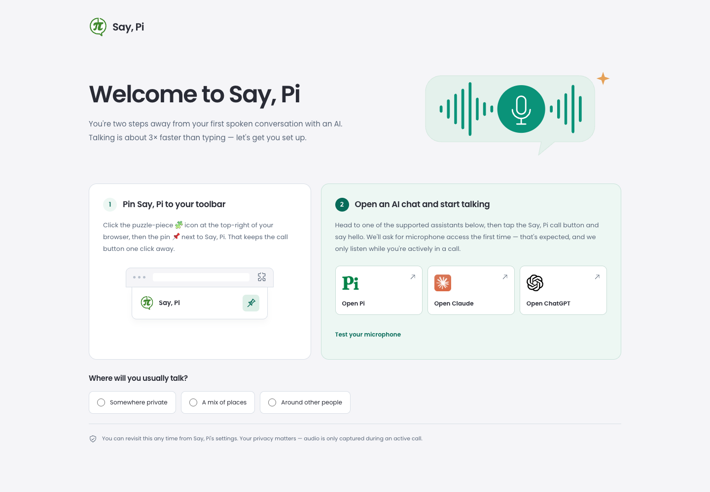

# A welcome that looks like Say, Pi

The first-run page used a separate purple palette, Roboto, and a narrow column of instructions. It looked disconnected from the product a person had just installed. This proposal gives that existing flow the Poppins typography, teal actions, cool neutral background, and green logo used by Say, Pi. The visual source is `saypi-saas/ds-bundle`, derived from its Tailwind theme.

A wider welcome introduces the two steps together. A small toolbar illustration shows where to pin the extension; the second step has recognizable assistant logos and larger click targets. The environment question stays optional, and its selected state is visible across the full label. A static speech illustration gives the page a voice identity without an animation loop or a new dependency.

The layout stacks on narrow windows. [Narrow view, including microphone and environment feedback](narrow.png).

## What this preserves

All three assistant destinations, the microphone permission/test lifecycle, local quiet-mode selection, and the first-install gate remain intact. Translations still own their existing labels; the two decorative emoji prefixes were removed consistently across all 32 locales, with the words unchanged. Labels sit inside assistant links so localization cannot replace their logos. The Poppins fonts and their SIL license ship locally, removing the previous Google Fonts requests.

This page does not itself collect goal analytics: it sets `quietMode` locally. Goal capture continues through the web signup choices and the host hint at extension connection. The admin activation/retention funnel, first-conversation signals, and post-win survey are unchanged. This is a visual proposal; an activation or retention improvement has not been measured.

## Verification

- The 71 existing onboarding tests pass, plus five new integration tests against the actual HTML. The artwork/localization test first failed against the old markup.
- A real extension-browser test checks offline font/artwork loading, secure assistant destinations, stored quiet mode, synthetic microphone start/stop, the hidden meter, keyboard focus, and narrow overflow. No real host conversation is needed.
- Independent visual review checked desktop/360px screenshots and 30 width/language combinations: 320, 375, 701, 800, and 1080px with English, German, French, Tamil, Arabic, and Russian. No heading or action-card overflow was found.
- The font license is verified in the generated extension output.

Related functional issues remain tracked separately: #612 (toolbar versus in-page call instructions), #613 (Settings return path), #614 (quiet-mode explanation/persistence feedback), and #615 (microphone success evidence). This proposal does not claim to resolve them.

Prepared with Codex. The design is for founder review before merge; store distribution remains a separate release. Real-host spend for this work: zero runs.
