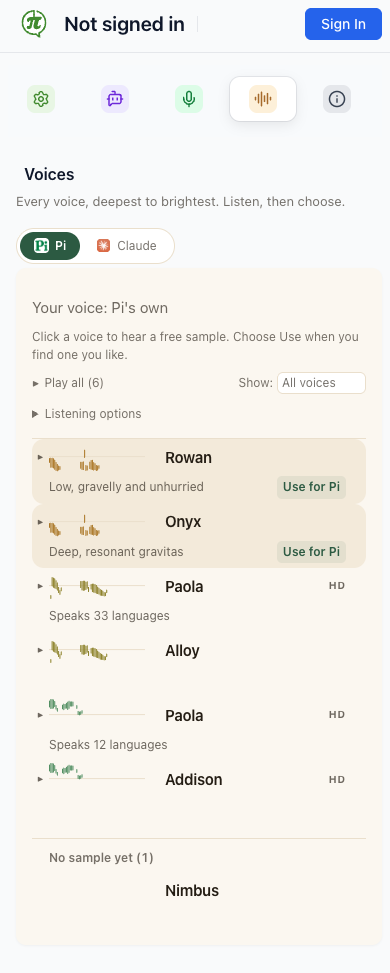
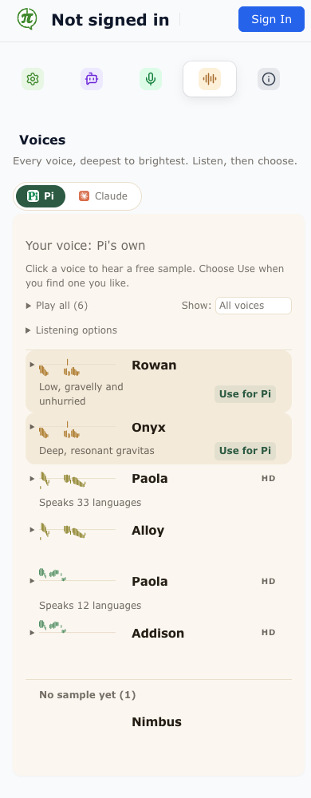

# Voice-choice release candidate — 5 September 2026

This candidate makes choosing, hearing and keeping a voice a clearer flow. The
saved voice leads the studio; listening leaves that choice intact; an explicit
Use action confirms a successful save. Saved preferences survive temporary
catalog failures, and returning to an assistant's own voice remains available.
Pi's native settings show a readable current-voice notice with Change voice
beside it, and choosing a Pi card relinquishes SayPi's override.

The reviewed source revision is
[`8d91a5b81e5c0c8accb34d3a8711f34b25d8a018`](https://github.com/Pedal-Intelligence/saypi-userscript/commit/8d91a5b81e5c0c8accb34d3a8711f34b25d8a018),
based on `9d0e620` after the three supporting slices merged. Its complete tree
is identical to the locally tested `e5fe164`; the intervening merge only
synchronizes history. It combines the work in these PRs:

| PR | Contribution |
| --- | --- |
| [#607](https://github.com/Pedal-Intelligence/saypi-userscript/pull/607) | Pi notice readability, direct voice change, native return and stale-read protection |
| [#608](https://github.com/Pedal-Intelligence/saypi-userscript/pull/608) | Preserve saved choices and provider ownership when a voice cannot resolve |
| [#609](https://github.com/Pedal-Intelligence/saypi-userscript/pull/609) | Studio choice/listening flow, responsive controls, combined candidate and browser coverage |
| [#611](https://github.com/Pedal-Intelligence/saypi-userscript/pull/611) | Wait for offscreen creation before dispatching concurrent audio messages |

The proposed release target is **1.14.0**, from read-only release planning. No
version bump, production packaging, signing or store submission is recorded by
this evidence. PRs #607, #608 and #611 have merged after independent review and green CI.
The remaining studio PR #609 contains the final review follow-up below.

## Final review follow-up

The studio now identifies the saved voice by its audio provider. A voice's
`default` flag does not identify who speaks: native Pi 4 is not the default,
while a remote voice can carry that flag. The previous test fixture incorrectly
labelled an OpenAI voice as native. Tests now use actual `PiAIVoice` instances
for Pi 1, 4 and 8, and separately cover a default remote voice. Pi 4 and 8 and
the remote case failed before the correction. A browser regression seeds Pi 4
in real extension storage and checks the studio after reopening.

The generic `voicesUseShort` translation key was also removed from all 32
bundles after verifying that no runtime call uses it. The explicit host-scoped
Use action already replaces it. An independent reviewer approved the provider
classification and verified that the locale edit changes no other values.

The signed-out summary uses the existing sign-in guidance for both a resolved
remote choice and an unresolved saved ID. Rechecking the choice also repaints
when authentication changes even if its ID is unchanged; it keeps the catalog
cached and does not write the preference. Two controller cases reproduced the
incorrect speaking/unavailable wording before this correction. This establishes
rendering from the supplied authentication state, not live authentication
handoff to an already-running audio actor.

## Verification

The final combined source (`e5fe164`, tree-identical to `8d91a5b`) passes
typecheck, Jest **2/2**, Vitest **2,752 passed / one unchanged skip**, and
**25 Chromium settings/voice/Pi E2E tests** with no retries. These runs include
the final signed-out fixes and the native Pi 4 regression. The earlier
full Chrome CI and supplementary Firefox observations below retain their
original revision labels; the final PR checks are the merge gate for all
combined source changes.

| Evidence | Revision and result | What it establishes |
| --- | --- | --- |
| Full local source checks | `418ee71`: typecheck, Jest **2 passed**, Vitest **2,732 passed**, **1 existing skipped** | Preference, save/error, stale-read, provider, UI and offscreen regressions pass on the source tree containing the final mobile correction. |
| Chromium voice/settings checks | Final mobile correction: **21 related E2E tests passed**, plus **2 focused screenshot cases** | Built settings/Pi flows, storage, media progression and layout work against local mocks; both ordinary system fonts and a wider font preserve readable descriptions. |
| Required candidate CI | `418ee71`: [Node check](https://github.com/Pedal-Intelligence/saypi-userscript/actions/runs/33952778402/job/101270523676) passed; [Chromium E2E](https://github.com/Pedal-Intelligence/saypi-userscript/actions/runs/33952778401/job/101270523761) **40 passed, no retries** | All final combined tests pass, including microphone input, synthetic speech, Opus upload, service-worker recycle, offscreen shutdown and both 390px font variants. Firefox advisory CI, path guard and secret scan also passed. |
| Earlier full Chromium CI | `7f4506e`: **38 passed**, one reproducible 390px Rowan-description clipping failure | Mic, synthetic speech, Opus upload and lifecycle checks passed on CI. The remaining layout failure is covered by the final correction and its fail-first font case. |
| Local full Chromium run | `7f4506e`: **36 passed**, three capture-dependent tests stalled | The local microphone condition described below limits this run; it is not recorded as a full pass. |
| Firefox MV2 | `418ee71`: development build, advisory smoke and **7 supplementary journey checks passed** on Firefox 155.0.1 | Real media progression, preview without saving, keyboard save, reload persistence, Play all/Escape and native return. See [Firefox evidence](firefox-verification.md) and [structured results](firefox-results.json). The desktop test window has a 500px minimum; 390px coverage is established by Chrome, not claimed for Firefox. |

The new Chromium voice journey exercises the browser's default autoplay policy.
A gestureless ordinary-page negative control is required to fail before the
user-started playback sequence is tested. Original media playing/timeupdate
events establish progress during previews, comparison and Play all. Real
extension storage establishes that preview does not commit a choice, saves are
isolated per assistant, native return persists, and another settings document's
change is reflected. Pi's tests also run the host fixture's own card handler and
measure at least 4.5:1 notice contrast in actual light/dark rendered colors.

Browser verification uses development artifacts, fresh profiles, committed
audio samples and local mock hosts with external traffic blocked. It does not
load production configuration or spend live STT/TTS credits. Existing test
assertions, timeouts and required checks were retained.

## Failures resolved within this candidate

The offscreen failure occurred before encoding or transcription. Chrome could
report an offscreen document's existence while its creation promise was still
pending; a concurrent VAD initialization request then arrived before the
listener was ready and was lost. The manager now waits for ongoing creation
before reusing that document, including when creation begins during the
existence query. Two deterministic cases failed on unchanged main before the
fix. The unchanged Opus, synthetic-STT and two lifecycle browser checks passed
on the isolated fix. See the [readiness rationale](../../../specs/2026-09-05-offscreen-readiness.md).

The CI layout failure exposed a font-width assumption: room reserved for the
clearer Use action left Rowan's description too narrow at 390px. The description
now wraps without moving into the action's space, and row height accommodates
the text. A wider-font case reproduces the failure locally and passes with the
correction. The original shared-chart alignment and duplicate-name checks
remain in place.

| 390px, system font | 390px, wider font |
| --- | --- |
|  |  |

Pi host-fixture screenshots show the notice and native return affordance in
[light mode](pi-voice-settings-light.png) and [dark mode](pi-voice-settings-dark.png).
These Pi screenshots record the isolated Pi slice, whose notice code is included
in the assembled candidate. Firefox screenshots and exact artifact provenance
are linked from its separate evidence record.

## Local capture limitation

The three local failures on `7f4506e` use Chromium's launch-flag fake microphone.
The in-extension synthetic source continued to transcribe. Offscreen logging
confirmed that VAD initialization reached its handler, so this was distinct
from the fixed message-delivery race.

A fresh Google Chrome for Testing **148.0.7778.96** profile, with **no extension
loaded**, also left a plain `getUserMedia({audio:true})` request pending for
15 seconds. It used the same fake-device, fake-permission and WAV-capture flags
on macOS **26.3.1**. The same stall occurs without the candidate extension, so
the candidate is not required to reproduce it. The control does not identify
a browser/OS/device root cause or explain every failing test independently. No
service, permission or device setting was changed by the diagnostic. Final CI
results must provide the capture-check evidence; successful physical microphone
acquisition is not claimed here.

## Historical live observations

The founder installed the combined development extension in Chrome for Testing
and authenticated SayPi and Pi. The live Voices tab loaded 15 voices, showed
Pi's own voice as current, and exposed the separate preview and Use controls.
A targeted read of the authenticated Pi page found exactly one SayPi call
button and the prompt. Its build stamp was still `b2c87a2`, so these observations
do not claim a live pass of the later offscreen and mobile corrections.

Computer use subsequently reported the Mac locked and the live observation
paused. Remote TTS, return to native Pi speech and first-turn completion were
not established by that observation. A native-tool timeout interrupted the
screen-reader attempt; the temporary VoiceOver process was stopped.

**Zero Layer-4 voice turns** or live STT/TTS calls were made in this review.
Physical microphone capture and human-audited speaker output are not established
by the hermetic results. The microphone test reached Chrome's permission prompt;
granting it did not produce a completed acquisition during observation.

The founder removed attended audio and screen-reader checks from the pre-release
checklist on 2026-09-05. These historical evidence limits do not block release;
the [release runbook](../../README.md#verification-scope) records the current
verification scope.

## Deferred work and release decisions

The separate onboarding findings are tracked for the requested follow-up work:
[toolbar versus in-page call guidance (#612)](https://github.com/Pedal-Intelligence/saypi-userscript/issues/612),
[the promised Settings return route (#613)](https://github.com/Pedal-Intelligence/saypi-userscript/issues/613),
[honest Quiet mode setup state (#614)](https://github.com/Pedal-Intelligence/saypi-userscript/issues/614),
[microphone-test success claims (#615)](https://github.com/Pedal-Intelligence/saypi-userscript/issues/615),
and [consent modal accessibility (#616)](https://github.com/Pedal-Intelligence/saypi-userscript/issues/616).
They remain open; this candidate does not claim to resolve them.

Before a store release, [#544](https://github.com/Pedal-Intelligence/saypi-userscript/issues/544)
still requires an actual decision: explicitly accept the residual risk of the
client-side voice-menu/studio behavior, or provide a tested remote lever that
returns it to a safe baseline. Server control of catalog content and samples
cannot repair a defect in local controls. This evidence does not accept that
risk on the founder's behalf. The initial approval was superseded by the final review, whose native-voice
and signed-out findings are addressed above and in the supporting PRs. Obtain
the release decision before treating the candidate as cleared for stores.

The English [release notes](../../../../_locales/en/release_notes.txt) are drafted
for founder review and now describe the voice release rather than the previous
onboarding release. The read-only submission-packet generator consumes that copy;
its checkboxes are a handoff checklist, not evidence that packaging or submission
has occurred.
