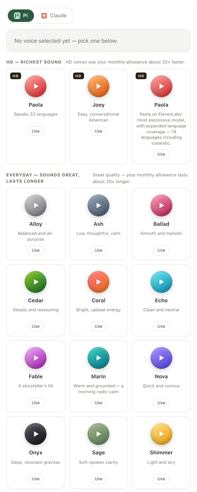
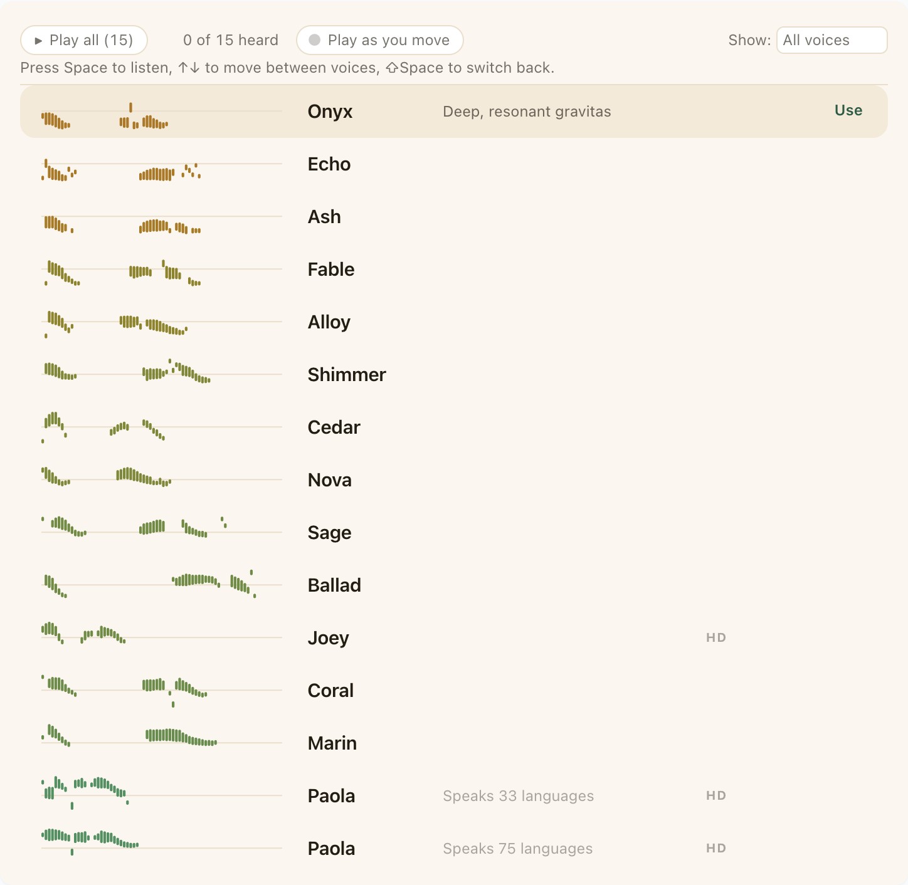
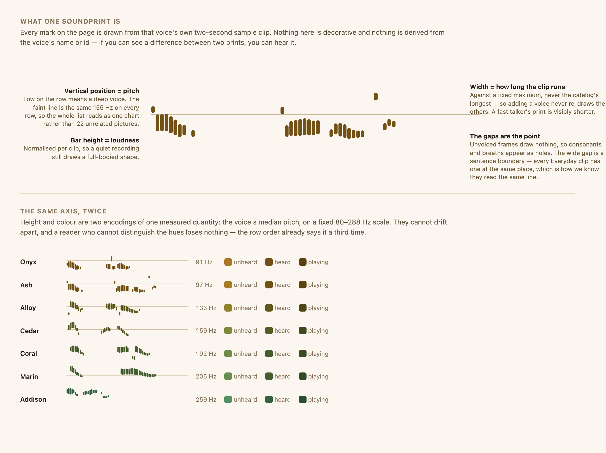
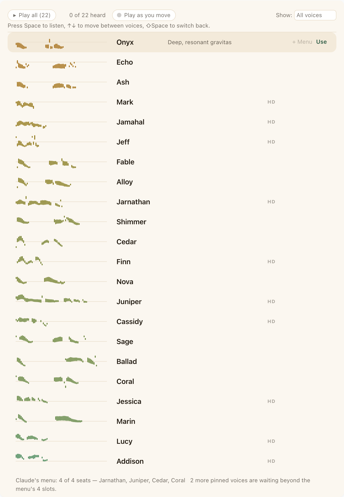

# The audition room — the design behind Settings → Voices

**A design document, not a specification.** It explains what this page is trying to do and why it
goes about it this way, so that you can make good decisions about it rather than merely consistent
ones. If you need geometry, storage shapes, file names or call sites, those live in
[`doc/plans/2026-07-31-voices-audition-room-design.md`](plans/2026-07-31-voices-audition-room-design.md).
Read this one first; that one only makes sense once you know what it is serving.

---

## 1. The problem

SayPi's voice catalog went from a handful to 22 and will keep growing — the server owns it, and new
voices arrive without a client release. The obvious framing is *"we have too many voices, how do we
avoid overwhelming people?"*, and the obvious answer is tiers, shelves and progressive disclosure.

That framing is wrong, and it produced the page we replaced:

Look at what that page asks of someone choosing a voice. Twenty-two coloured circles, each of which
must be clicked individually to hear anything. Names that mean nothing (*Ballad*? *Onyx*?). Taglines
that are honest but thin — "Smooth and melodic" and "Soft-spoken clarity" are not a decision. Two
cards both called **Paola**, distinguished only by the length of their descriptions. A hero panel
whose entire job is to announce that nothing has happened yet. Tier headings that state one fact
twice, from both ends.

The real problem is narrower and more useful than "too many voices":

> **A voice cannot be evaluated by reading.** Every name, tagline, badge and colour on that page is a
> *proxy* for the one fact that decides the choice: what it sounds like. So the page's job is not to
> organise proxies more cleverly. It is to get the user to sound as fast as possible, and to let them
> compare what they heard.

The old page was a **directory**. It answered "what voices exist?" — a question nobody has. The
question people actually have is "which of these do I want talking to me every day?", and answering
it on the old page meant twenty-two separate clicks with no memory of which you had already tried.
By the seventh card you have forgotten the first.

---

## 2. Goals

In priority order. When two conflict, the higher one wins.

1. **Time-to-ear.** Minimise actions between opening the page and hearing a voice. Then minimise
   actions to hearing a *second* one, because one voice in isolation tells you almost nothing.
2. **Comparison without memory.** The user must be able to put two voices back-to-back at will, and
   must never need to remember what something sounded like a minute ago.
3. **Legible at a glance.** Before reading a single word, the shape of the page should tell you
   something true about the voices in it.
4. **Calm.** This is a settings page inside a product about being hands-free and unbothered. It
   should not feel like an audio workstation, and it should not feel like work.

### Non-goals, stated so you don't drift into them

- **Not a catalog browser.** Completeness, filtering power and metadata richness are not virtues
  here. If a control does not help someone *choose*, it is clutter.
- **Not a place to show off the catalog's size.** Twenty-two is not a feature.
- **Not a configuration surface.** There is exactly one commitment (`Use`) and one optional
  refinement (pinning, on hosts that have an in-chat menu). Resist adding a third.

---

## 3. Constraints

These shaped the design more than the goals did. Several are not obvious.

**Every preview must be free.** Sample clips are pre-rendered, served without credentials, and cached
for a year. This is the single most load-bearing constraint on the page: it is why the user can play
everything, repeatedly, in any order, with no meter running and no warning copy. Anything that
introduces a per-play cost breaks the page's whole posture. See §6.

**The catalog is server-owned and grows.** A voice can appear tomorrow. Nothing may be hard-coded per
voice, and nothing may re-draw the existing voices when a new one lands. Scales are therefore keyed
to **fixed constants**, never to the catalog's own min/max.

**The pane is narrow and fixed.** Settings open in a browser tab with a content column that is the
same width at 1100px and at 1920px. The page gets roughly 690px and cannot ask for more — a
Voices-only width rule is a known regression class here. Design for a narrow column; do not assume a
wide one appears on big screens.

**The two hosts are not symmetric.** Claude has an in-chat voice menu with a small number of seats,
so pinning means something there. Pi retired its menu, so pinning would be a control that does
nothing. The page must degrade to "no menu concept at all" without looking broken or half-built.

**Everything is translated.** Copy lands in ~30 locales, some 40% longer than English. Chrome's i18n
has no plural forms. Counts must read correctly at 1 without a second string.

**Accessibility is not a pass at the end.** Audio that starts on its own is hostile to a screen
reader user, and colour that carries meaning alone is hostile to a colourblind one. Both are designed
around from the start rather than patched.

---

## 4. Design philosophy

Six principles. Most of the specific decisions below fall out of them, and if you are weighing a
change, these are the things to weigh it against.

### Every mark must be measured

Nothing on this page may *look* informative while carrying no information. The previous design's
gradient orbs were derived from a hash of the voice's id: they looked like a code you could learn and
were noise. That is worse than plain grey, because it invites the user to find a pattern that is not
there.

The rule that replaced it: **if you can see a difference between two marks, you must be able to hear
it.** Every pixel of a voice's mark comes from the audio you are about to judge.

### Spend colour on order, never on identity

Colour was banned from the previous redesign for good reason — 22 hues is confetti. But the ban was
aimed at the wrong target. What made the orbs bad was not colour; it was that the colour was
*arbitrary*. A single ordered ramp, keyed to a measured quantity, is the opposite of confetti: it
reads as one gradient flowing down the page and reinforces the ordering that is already there.

So: **no voice has a colour. The scale has a colour.** If you ever find yourself picking a swatch for
a particular voice, you have left the design.

### Encode important things more than once

Pitch is expressed three times: the row order, the vertical position of the trace, and the hue. This
is deliberate redundancy, not repetition. A user who cannot distinguish the hues loses nothing, and a
user who does not consciously notice the ordering still absorbs it from the shape.

### The page must not cost money

Nothing here spends a credit, so there is no budget to explain, no warning to write, no
"are you sure?", and no reason not to press play on everything. A large part of why the page feels
relaxed is that it *is* free, and the user can tell.

### Calm at rest, informative on demand

Twenty-two rows of full-strength detail is a wall. So the resting state is quiet — name, mark, and
nothing else — and the row you are pointing at reveals its description and its actions. The exception
that proves the rule: a voice whose name is ambiguous (two Paolas) shows its differentiator
**always**, because a disambiguator that hides does not disambiguate.

### Don't make the user hold state in their head

The page remembers what you have heard, so you never re-audition by accident and never lose your
place. The comparison pair populates itself from what you actually listened to, so "play the other
one" needs no setup. Anything that requires the user to track something mentally is a design failure
to be fixed, not a feature to be documented.

---

## 5. The approach

One list, called **the rail**. Every voice is one 42px row. There are no cards, no tier shelves, no
hero panel, and no rules between rows — separation comes from rhythm.

### Ordered by pitch, deepest to brightest

Price was the old organising axis: *HD* and *Everyday*. That is the vendor's axis. Nobody thinks
"I would like an Everyday voice"; they think "something deeper" or "something brighter". Pitch is a
listener's axis, it is continuous rather than chopped into two bins, and — unlike accent (populated
but nearly constant) or speaking rate (not populated at all) — it can actually be sourced, by
measuring it.

Tier survives as a **badge and a filter**, which narrow a continuum, rather than as shelves, which
chop it. The cost note that used to be a decorative shelf heading now sits on the HD filter, where it
is actionable at the moment it is relevant.

### Each voice is drawn from its own clip

The **soundprint** is the page's signature. It is the same single decode pass that produces the
ordering, the mark and the loudness match — which is why it is the signature and not a garnish.

The faint horizontal line is the load-bearing detail. It sits at the same frequency, at the same
height, on every row. Without it you have 22 unrelated little pictures; with it you have one chart,
and the eye reads a continuous descent from deep to bright before it reads a single name.

Two voices that sound alike look alike. A fast talker's print is short. A monotone voice is a flat
ridge. The gaps are consonants and breaths — and the wide gap in the middle is a sentence boundary,
which is how we discovered that the Everyday clips all read the same line (see §6).

### Listening is the primary interaction, and the keyboard is the primary instrument

`Space` plays the row you are on. `↑↓` walk. `⇧Space` plays *the other* of the last two voices you
heard, without moving focus or scroll. `Enter` commits. That is the whole model, and it makes the
central act — hear this, hear that, hear this again — a two-finger operation.

Mouse users get the same thing: the entire row is the play target, and the compare control in the bar
fills in visibly as they walk, which is how they discover it exists.

**Arrow keys do not play until you have explicitly played something.** This one rule buys three
things at once: a screen-reader user is never ambushed by audio, the browser's autoplay policy is
satisfied by a real gesture before anything chains, and nobody ever gets noise from merely opening
the page. There is a visible toggle for people who want it off permanently.

### Comparison has no mode

There is no "compare view" to enter and leave. The page silently tracks the last two distinct voices
you auditioned, seeded with your current one — so your very first `↓` then `⇧Space` is
incumbent-versus-challenger, which is the actual decision, with no setup at all.

Clips restart rather than resuming mid-phrase. ABX tools carry the playhead across the switch, which
is right for 30-second excerpts and wrong for 1.5-second ones where the same offset lands on a
different word. The opening is where a voice's character is clearest anyway.

### The page develops as you listen

Prints start faint and ink in once heard. A first-time visitor correctly sees a page of things they
do not know yet; the rail literally fills in as they work down it. There is no threshold and no mass
transition — it is the same variable, moving.

The counter (`9 of 22 heard`), the `Not yet heard` filter and `Play new (13)` are the half of this
that makes a hundred voices tractable. If only one part of the heard-state idea ever ships, it should
be those, not the ink.

### Per-host, without pretending the hosts are alike

Claude has a four-seat in-chat menu, so its rows carry a pin control and the page ends with a plain
summary of what is currently seated. Pi has no menu, so none of that renders — not greyed out, not
explained away. Absent. A host declares whether it has a menu; the page follows.

---

## 6. What we deliberately did not build

The reasoning matters more than the list, because these are the ideas that will be re-proposed.

**Typing your own sentence and hearing every voice say it.** This was approved and then cut on
evidence. The case for it was that fixed clips cannot support a fair comparison — but measurement
showed all twelve Everyday clips pause at the same point in their span (0.35–0.42), while the HD
clips scatter or have no pause at all. Twelve out of twelve inside a band that narrow does not happen
with twelve independently written scripts: **they already read the same line**, so the free
comparison is already fair where the choice is actually made. On top of that, the pricing helper
rounds to zero credits for short text, so we could not have shown an honest price for exactly the
kind of short phrase people would type. Cutting it left the page with no cost model at all.

*What would bring it back:* the HD clips being re-rendered on the shared line (an ask already filed),
or a flat-rate, server-cached preview endpoint. The seam was left in place.

**Per-voice colour.** See §4. The ramp is a scale, not 22 identities.

**Tier shelves.** Price is the vendor's axis.

**A tournament or funnel.** Multi-step flows that ask the user to shortlist, then compare, then
commit look tidy in a diagram and feel like work. `⇧Space` delivers the same outcome with no stages.

**Auto-advance as the opening gesture.** `Play all` exists, but it is not what the page offers first.
The invitation is "hear one voice", not "commit to a minute of audio".

**A "New" badge on recently added voices.** The catalog carries no date. It would be a claim the data
cannot support.

---

## 7. How to tell whether a change is good

Concrete tests, in rough order of how often they catch things:

- **Does it add a mark that isn't measured?** If a new visual element could be drawn identically for
  a voice that sounds completely different, it does not belong.
- **Does it make the resting page louder?** Detail belongs on the focused row. The exception is
  anything a user needs in order to tell two rows apart.
- **Does it cost a credit?** If yes, you have changed the page's posture and you now owe the user an
  honest, explainable cost model. Be sure it is worth it.
- **Does it re-draw existing voices when the catalog grows?** Scales must be keyed to fixed
  constants. If adding a 23rd voice reflows the other 22, it is wrong.
- **Can a keyboard-only user do it? Can a screen-reader user do it without being ambushed by audio?**
- **Does it survive a 40%-longer translation, and read correctly at a count of 1?**
- **Does it still work at ~690px?** Do not design against a wide window; there isn't one.
- **Is colour carrying meaning on its own?** It must always be the third encoding of something, never
  the first.

And the blunt one: **does it get the user to sound faster, or does it get between them and the
sound?** That is the whole page.

---

## 8. Known soft spots

Honest list, for whoever picks this up.

- **The row is wide and the middle is quiet.** At rest, the space between a voice's name and the
  right edge is empty. It is deliberate (detail on focus only) and it is the thing most likely to
  read as institutional rather than calm. If you want one thing to improve, this is it.
- **Focus-triggered playback has not been through a real screen reader.** The arming rule is designed
  to make it safe. It has not been proven with VoiceOver or NVDA. If that goes badly, the fix is to
  flip arrow-audition to opt-in — a single constant, not a redesign.
- **Sticky autoplay activation is designed around, not verified.** The automated harness disables
  autoplay policy outright, so a green test there proves nothing. It needs a real browser check.
- **Two server-side asks are outstanding**, both with measurements attached: the ten HD clips should
  be re-rendered on the line the Everyday clips already share, and one voice (Sage) ships about 7 dB
  quieter than the pack, which makes it lose comparisons for reasons that have nothing to do with how
  it sounds.
- **Tier is still binary.** HD and Everyday are a pricing artefact. If the catalog ever gets a third
  tier, the filter absorbs it, but the copy will need rethinking.
